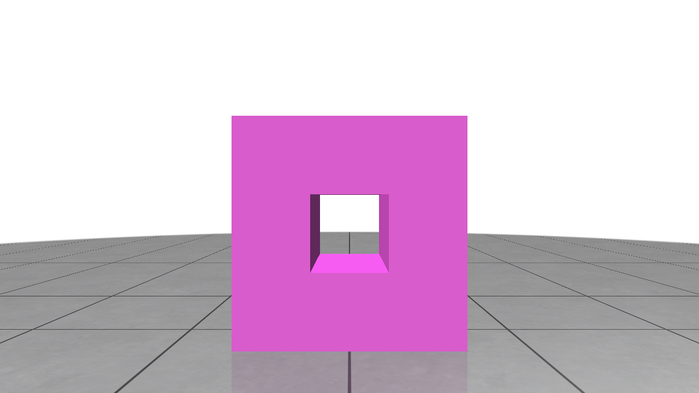
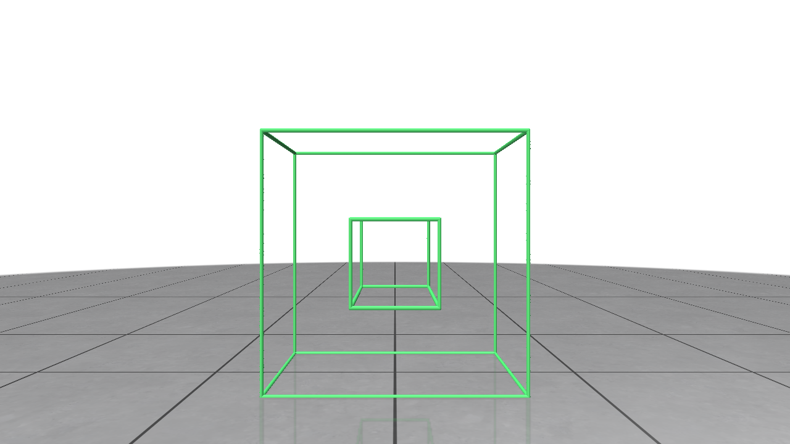

# Euler Sweep

本项目实现了半边数据结构的Brep表示和mvsf、mev、mef、kemr、krmfh五个欧拉操作，并且实现了基于欧拉操作的扫程。

## Dependency

- [polyscope](https://github.com/nmwsharp/polyscope)：可视化和UI
- [libigl](https://github.com/libigl/libigl)：三角化
- [catch2](https://github.com/catchorg/Catch2)：单元测试

## Compilation

使用如下命令来编译本项目

```
mkdir build
cd build
cmake ..
make -j4
```

## Results


